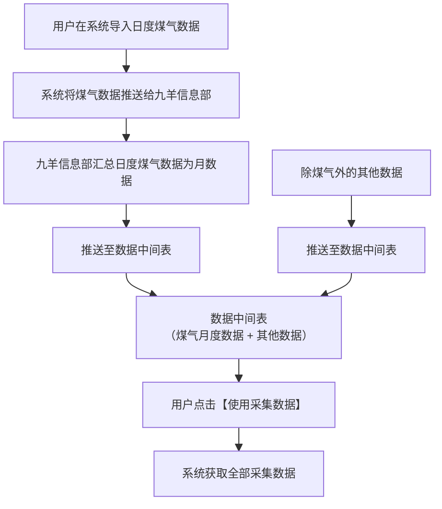
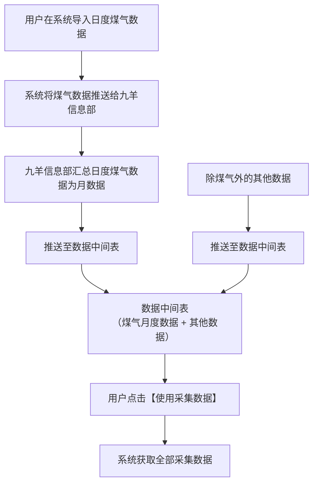
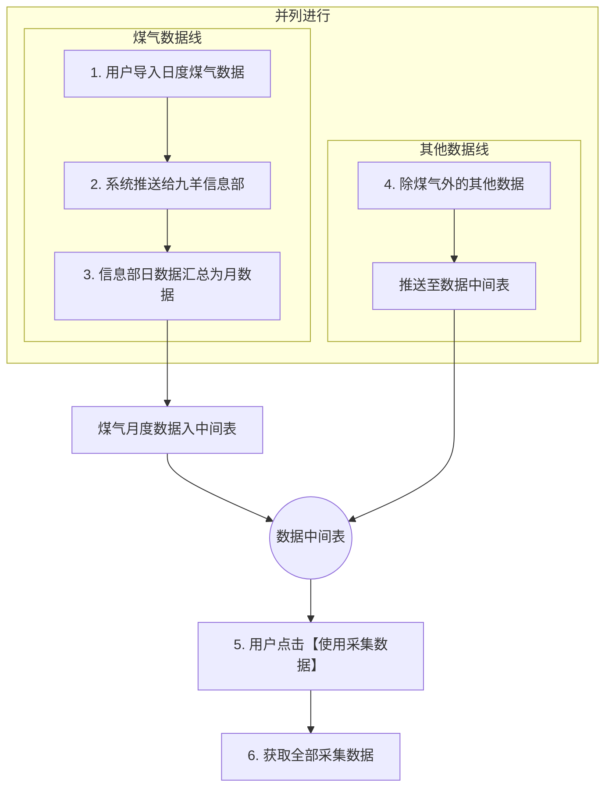
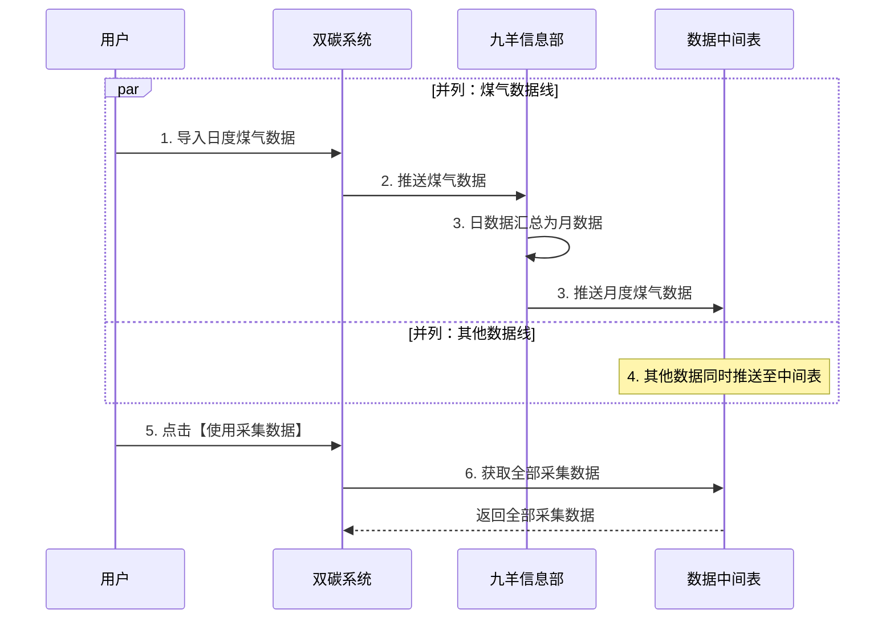

# 双碳管理系统 · 煤气数据采集流程

## 数据流向说明

1. 用户在系统导入日度煤气数据（gas-data.html 的「导入」入口）；
2. 系统将煤气数据推送给九羊信息部；
3. 九羊信息部将日度煤气数据汇总算成月数据，推送至数据中间表；
4. 同时，除煤气外的其他数据也推送至数据中间表；
5. 用户在系统点击【使用采集数据】；
6. 系统获取到全部的采集数据。

其中 **1、2、3 和 4 是并列同时进行**的（1→2→3 是煤气这条线的先后顺序，4 是独立支线）。

## Mermaid 流程图

### 核心版（紧凑：整体约缩小一半）

> 第一行的 `%%{init}%%` 把字号（16→12px）、节点间距（50→25）、层级间距（50→25）、内边距全部压缩，
> 渲染出来的图整体约为默认尺寸的一半。嫌大就调小这三个数值，嫌挤就调大。



### 核心版（原始尺寸，备用）



### 严格等比缩放 50%（网页嵌入时用）

Mermaid 语法做不到像素级精确的「等比 50%」，如果是在**网页/HTML 里嵌入**，
用 CSS transform 可以精确缩一半（包在外层容器上）：

```html
<div style="width: 50%; margin: 0 auto;">
  <div style="transform: scale(0.5); transform-origin: top left;">
    <pre class="mermaid">
flowchart TD
    A[用户在系统导入日度煤气数据] --> B[系统将煤气数据推送给九羊信息部]
    B --> C[九羊信息部汇总日度煤气数据为月数据]
    C --> D[推送至数据中间表]
    E[除煤气外的其他数据] --> F[推送至数据中间表]
    D --> G[数据中间表]
    F --> G
    G --> H[用户点击【使用采集数据】]
    H --> I[系统获取全部采集数据]
    </pre>
  </div>
</div>
```

### 并列关系标注版（带子图）



### 时序视角（可选）


